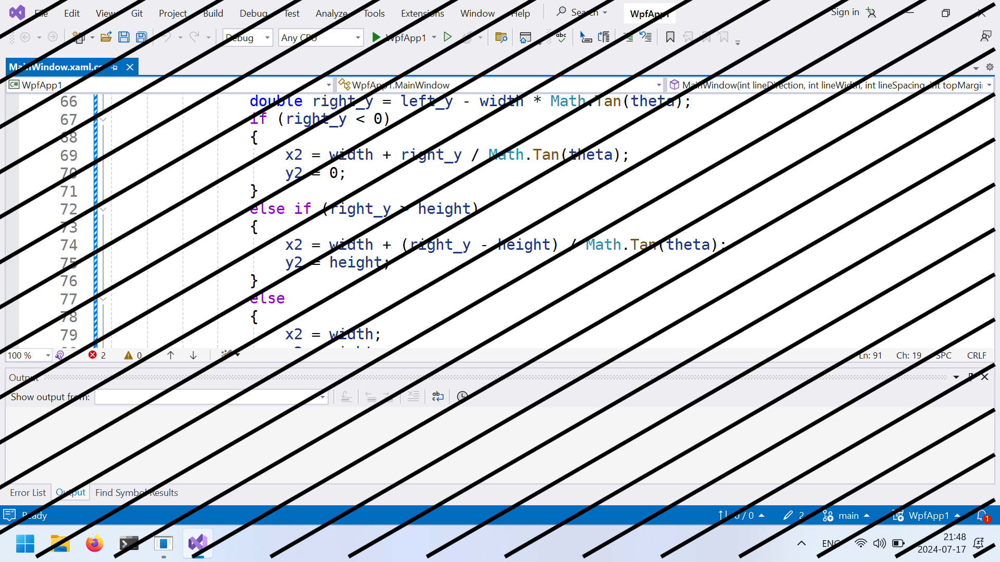

This is the Windows version of [diagonator](https://github.com/yaxollum/diagonator). It can be built using Visual Studio 2022.

## Command-line options
|Option|Description|
|-|-|
|`--line-direction <degrees>`|Direction of the lines (counterclockwise from the bottom of the screen)|
|`--line-width <pixels>`|Width of the lines|
|`--line-spacing <pixels>`|Spacing between the lines|
|`--top-margin <pixels>`|Top margin|
|`--bottom-margin <pixels>`|Bottom margin|
|`--left-margin <pixels>`|Left margin|
|`--right-margin <pixels>`|Right margin|
